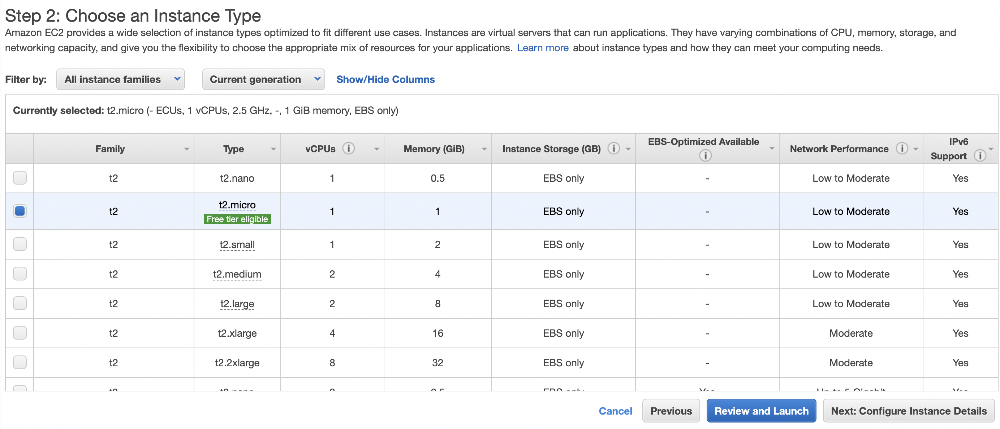

# 網站部屬 - 使用 AWS EC2 + LAMP

## Part1: 設置 AWS EC2 主機

---

1. 註冊 AWS 帳戶

2. 登入 as root user

3. 進入 EC2 dashboard 

   

4. 將主機位置設置在離台灣較近的東京，以增加連線速度

   

5. 建立主機

   

6. 選擇 Ubuntu LTS (Long Term Support) AMI (映像檔，可以把它理解為光碟)


7. 選擇免費版，然後 Next

   

8. 三到五步驟可不用修改設定，直接 NEXT

9. AWS 防火牆預設用 SHH 連線，從 22 port，所有 ip 都能連到。我們要用新增 HTTP/ HTTP 連線，然後 NEXT

   

10. 最終 Review。確認無誤就可以按下 Launch。

    


11. 這時會被要求選擇金鑰，如事先有創立過了就直接選擇之前的，若沒有就建立一個新的，再替他取一個任意名稱。最後按 "download Key Pair" 來將金鑰檔下載下來


12. 再來就可以看見自己的主機已經順利跑起來了


## Part2: 連線到主機、基礎設置

---

1. 這邊就是我們建立的主機，勾選後按下連線


開啟 CLI， cd 到金鑰所在的工作路徑，利用 SSH 來連線到主機

（註：如果出現金鑰權限太高的警示就要跑 `chmod 400 <金鑰檔>` ，以確保金鑰無法公開檢視


看到 `ubuntu@ip-xxx....` 就表示成功連線到遠端主機囉

> `top` 指令可以查看主機狀態，`q`離開


2. 更新作業系統。利用管理員權限 (sudo)，透過 apt 這個作業系統的套件管理工具來更新

   `$ sudo apt update && sudo apt upgrade && sudo apt dist-upgrade`


## Part3. LAMP server (Linux + Apache + MySQL + PHP/Perl/Python) 安裝

---

1. 首先我們可以安裝 tasksel 來協助 LAMP 的快速建置 （當然一個個分別裝也是可以的） 

   `sudo apt install tasksel`

2. 再來就可以用安裝好的 taskel 來把 LMAP server 裝起來

   `sudo tasksel install lamp-server`

   網站的預設根目錄是在 `/var/www/html`，當用網頁打開 server 預設會顯示根目錄底下的 `index.html`。安裝好之後開啟瀏覽器，輸入 public IPv4 經該就能看見以下的 default 頁面，表示安裝成功 


## Part4. 資料庫系統設置 

---

以下分別介紹 phpmyadmin 和 sequel pro 的設置方式

#### phpmyadmin

1. 下載 phpmyadmin

   `sudo apt install phpmyadmin`

2. configuring phpmyadmin: 選擇連接 apache2 

3. 完成設置密碼

4. 設定 root 帳號來設定密碼用以管理 MySQL 資料庫

   - 進入 MySQL shell

   `sudo mysql -u root mysql`

   - 啟用 mysql_native_password 插件，開啟使用密碼及使用密碼登入的功能

   `UPDATE user SET plugin='mysql_native_password' WHERE User='root';`

   - 重新載入特權表

   `FLUSH PRIVILEGES;`

   - 設定密碼。這時可以選擇由簡單到複雜 (0~2) 的密碼。

   `sudo mysql_secure_installation`

   

5. 設置完成後在瀏覽器輸入：`public IPv4/phpmyadmin` 能夠進到這樣的畫面就代表設置成功


:::caution 除錯的部分

如果在密碼設置完之後還沒有辦法順利進入步驟五的畫面，而出現錯誤畫面，可以參考以下排除。

1. 用 nano 打開 apache2 config 檔

   `sudo nano /etc/apache2/apache2.conf`

2. 將以下段加入到檔案的最後面 （這邊可以開啟允許滑鼠滑動就能快一點滑到底部）

   `Include /etc/phpmyadmin/apache.conf`

3. 儲存退出後就可以重啟 apache

   `sudo /etc/init.d/apache2 restart`

:::


#### Sequel pro

依照上述步驟我們有了 root 帳號及密碼可供管理資料庫，若是對 phpmyadmin 有安全上的顧慮的人也可以參考以下 sequel pro 的使用。 

**但由於預設只能由本機登入 MySQL，我們必須再做點設定修改**

1. 以 phpmyadmin 登入進到管理頁面
2. 點選對帳戶 root 作「編輯權限」
3. 進入登入選項將主機名稱下拉式選單選到 「任意主機」，此時會看到後面的欄位變為 "%"
4. 再回到使用者帳號一覽，就能看見多了一組使用者名稱同為 root ，而主機名稱為 "%" 的帳戶。這樣表示設置成功，即準備好能夠從其他軟體進行連線

**Sequel pro 設置**

1. 到官方網站 [下載 Sequel pro](https://sequelpro.com/download)
2. 新增 SSH 連線如下：


參考文章：

https://magiclen.org/lamp/

[Connecting to your AWS EC2 database with Sequel Pro](https://xavianaxw.medium.com/connecting-to-your-aws-ec2-database-with-sequel-pro-edc7f6530e64)

[學長姐筆記](https://alirong.coderbridge.io/2020/10/08/week14-Deploy-Website/)


## Part5. 上傳檔案到 Ubuntu Server

---

#### 使用 FileZilla

1. 開啟「站台管理員」，點選「新增站台」來新增一個連線。協定為 SSH，主機填上 Public IPv4，最後選擇以金鑰檔案登入，底下選取金鑰存放路徑即可點選連線。


2. 成功連線後進到 `/var/www/html`，這個路徑為 apache server 預設的根目錄，因此我們網站的檔案都需傳到這路徑底下以順利跑起來。這邊可以開一個專案資料夾來管理所有相關的檔案，或將現存的檔案直接拖曳到路徑下。  

   （若使用已有專案，要注意 `conn.php` 當中的連線資訊是否無誤，以及其他串接後端 api 的檔案的路徑也要一併修改過）


到這邊我們的網站已經順利部屬到虛擬主機，也能如其運行，接下來的步驟將要購買網域名來和虛擬主機串連。


#### 其他方法

1. 如果專案有上傳到 GitHub 或 GitLab，可以直接在虛擬主機 clone 下來

2. 利用 `scp` 指令把檔案傳輸到虛擬機上面 

   ```shell
   # 複製目錄到遠端
   scp -r ./dist/* myuser@192.168.0.1:/path/file2 
   ```

   

   

## Part6. 串連網域和虛擬主機、網域設定

網域由 Gandi 購得後，可進到 「區域檔紀錄」來進行網域設定 

設定 A (Address)：我們的 domain 對應到的 IP (Public IPv4)

這個設定連結了 domain 和虛擬主機的 IP，如此以後想要瀏覽主機管理的網頁就不必在辛辛苦苦地打上一長串 IP，也更容易分享給親朋好友。

 


