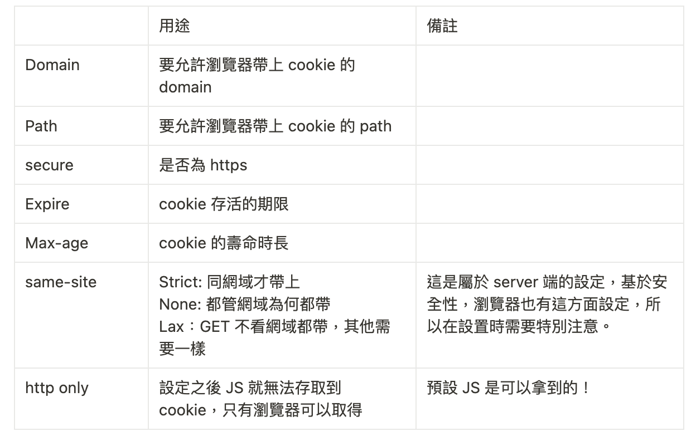

# Cookie and Session

## HTTP 的無狀態性質

---

HTTP 是無狀態的，無法記住每個 request 之間的關聯。如果需要這樣的聯繫，例如登入登出功能記住使用者有無登入過，可以實作 session 機制來達成。

## Session

---

需要關聯的 request，代表我們需要在一段時間內保有某種狀態，這樣一段時間內的狀態稱為 session。 例如：登入就開始了一段 session，經過某秒之後系統自動把你登出，session 結束。

session 具有幾個特性：

1. 每個 session 都有開始與結束
2. 每個 session 都是相對短暫的
3. 瀏覽器或伺服器任何一方都可以終止這個 session

要實作 session 機制有許多不同方法，而因為一些好特性，其中最常用的為 Cookie。

## Cookie

---

Cookie 是 HTTP 中，實作（建立） session 的一個工具（容器），本質上是儲存在瀏覽器裡面的小份資料。

### Session-based cookie

是用 cookie 去實作 session 機制的方法。

**流程**

1. 前端發 req (ex: /login)
2. 後端在 res 加上 `set-cookie` header，裡面會放加密過的資料（使用者資料）
3. 瀏覽器看到後，會自動在下次的 req 帶上 cookie

> 缺點是，cookie 只能資料容量較小，且加密內容內容有可能被破解

**cookie 的常用屬性**

＃備註：同網域是指 same domain，不是 same origin

**cookie 種類**

- session cookie: 沒有特別設置 expire, Max-age，關掉瀏覽器就會被清掉了的這種
- persistent cookie: 有設置 expire, Max-age，到你設定的值之前都可以存活

### session data

如果想要存大分一點的資料，且不希望被破解，可以把 session 存在後端。

**流程**

1. 前端發 req (ex: /login)
2. 後端在 res 加上 `set-cookie` header，裡面會放 session id （不是實際機敏資料，而是一個對應那份資料的代號）
3. 瀏覽器看到後，把這個 session id 儲存起來，會自動在下次的 req 帶上 cookie
4. 後端看到這個 session id，拿著他去跟 session store （如：redis） 裡面紀錄的資料比對，取的相對應的資料返回給前端

> 若要安全性高的登入機制一般都會採用這個手法

## Reference

---

[淺談 Session 與 Cookie：一起來讀 RFC](https://blog.huli.tw/2019/08/09/session-and-cookie-part2/)

[成為看起來很強的後端系列](https://www.youtube.com/watch?v=HMX4KSDtfpw&list=PLS5AiLcCHgNxd341NwuY9EOpVvY5Z8VOs)
