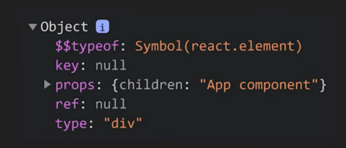

# React Virtual DOM and Reconciliation
React 利用 Virtual DOM 與 Reconciliation 來優化 DOM 的更新，這篇文章會介紹 Virtual DOM 與 Reconciliation 的原理與實作。
了解 Virtual DOM 與 Reconciliation 是什麼之前，要先了解 react element 與 react component 的概念。

React takes advantage of Virtual DOM and Reconciliation to optimize the update of DOM. This article will introduce the principles and implementation of Virtual DOM and Reconciliation.

Before understanding Virtual DOM and Reconciliation, we need to understand the concepts of React element and React component first.

## React element

---

當我們寫一個 React component 的時候，React 在背後會把 JSX 會被轉成 `React.createElement(...)` function call ，這個 function 會 return 一個 plain object 形式的資料。這也就是為何每次建立 component 都一定要 import React。

例如：現在有個 App component

```jsx
const App = (props) => {
  const { name } = props
  return <div id={name}>hi</div>
}
```

實際上會轉換成以下

```js
const App = (props) => {
  const { name } = props
  return React.createElement(
    'div',
    {
      id: name,
    },
    'hi'
  )
}
```

如果呼叫的話 `console.log(App())` 會得到這樣的 object，這個 object 就是 react element。



> React.createElement
>
> 1. 第一個參數是 element 類型
> 2. 第二是 function component 的參數
> 3. 第三是 children

## React component

---

他是一個會 return element tree 的 class (class component) or function (function component)。

因此如果依照上面的例子，這 App 就是一個 react (function) component。

如果寫 `<App/>` react 會在背後幫我們...

- function component: 傳入參數呼叫 function component
- class component: 建立 instance, 呼叫 render function

## Virtual DOM

---

由上面可知，React 運作時會將 nested JSX 轉換成 object 形式的 react elements tree，也稱之為 virtual DOM。

## Reconciliation

---

初始時，這個 virtual DOM 直接跟真實的 DOM 同步就好。但當有任何 react elements 改變了呢？

React 不會直接去修改真實 DOM，因為修改 DOM 的效能成本是很大的，他會透過新舊 virtual DOM 之間的差異來判斷是不是要真的有需要改變，才 commit 到真正的 DOM，這個比對同步的過程就稱為 Reconciliation。

實際上 React 使用了 diffing algorithm 來優化這整個同步的過程。為了找出最少步數的操作去同步， diffing algorithm 有兩項假設：

1. 不同類型的 element 會產生完全不同的 virtual DOM

   > - 若不同類型（例如，同個位置從 　`<h1>` 換成了 `<h2>` 或 `<Component1/>` 換成了 `<Component2/>`)： React 會把 virtual DOM 重產
   >
   > - 若相同： 例如只是更新的參數，那就會只更新那個參數，不重產

2. 使用者應該要在經常動態變動的 elements list 中給定 **key**，且這個 key 要是不可重複的值

   例如以下範例，我們必須給定每個 `li` 一個 key 值。通常如果這個資料你可以確定他之後都不會變動，直接用 `index`即可。

   ```jsx
   const renderListData = () => {
     const data = ['one', 'two']
     return (
       <ul>
         {data.map((item, index) => {
           return <li key={index}>{item}</li>
         })}
       </ul>
     )
   }
   ```

   但更多時候，這個 data 可能會被動態改變，例如可能會在 `'one'` 之前被加上一個 `'zero'` ，那麼 key 的變化會是如下：

   ```
   item 'one' / key 0
   item 'two' / key 1

   == insert 'zero' =>

    item 'zero' / key 0
    item 'one' / key 1
    item 'two' / key 2
   ```

   可以看到，原本的 element 的 key 都跟原本不一樣了，但他們都還在畫面上，順序也沒有變，應該不需重新 render。 如果這種情況，我們不要用 index 作為 key，改定義一個固定的唯一值給每個 element，這樣 react 在 reconciliation 時就會知道 `one` 與 `two` 是沒有改變的，不用重新 render，只要插入 `zero` 即可。

   ```jsx
   const renderListData = () => {
     const data = ['one', 'two']
     return (
       <ul>
         {data.map((item) => {
           // 假設 item 不會重複，改用 item 作為 key
           return <li key={item}>{item}</li>
         })}
       </ul>
     )
   }
   ```

## Reference

---

[How Does React Actually Work? React.js Deep Dive #1](https://www.youtube.com/watch?v=7YhdqIR2Yzo&t=752s)

[Preserving and Resetting State](https://react.dev/learn/preserving-and-resetting-state#state-is-tied-to-a-position-in-the-tree)
