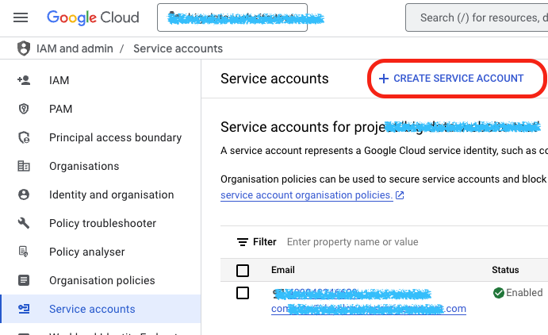
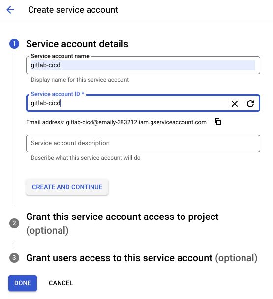
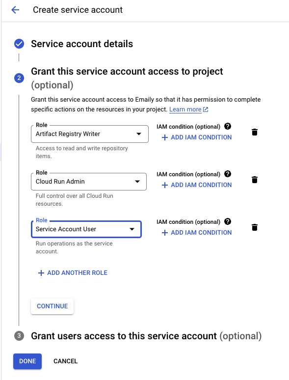
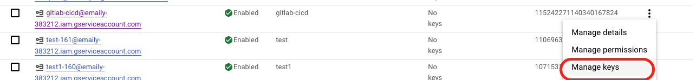
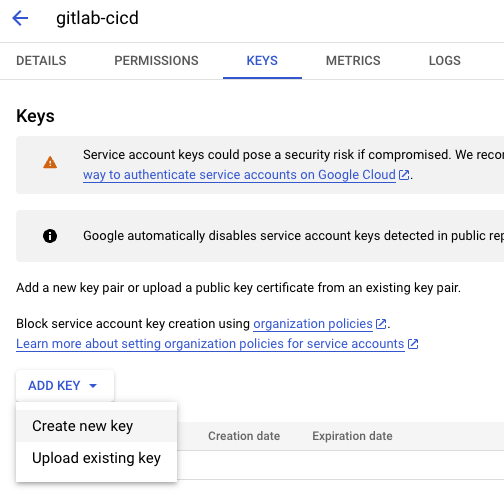
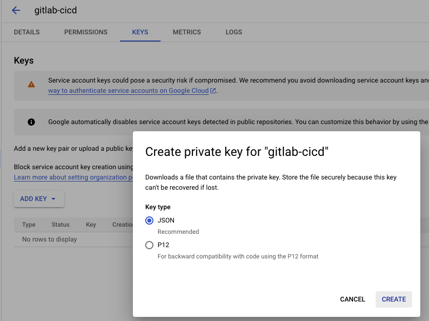
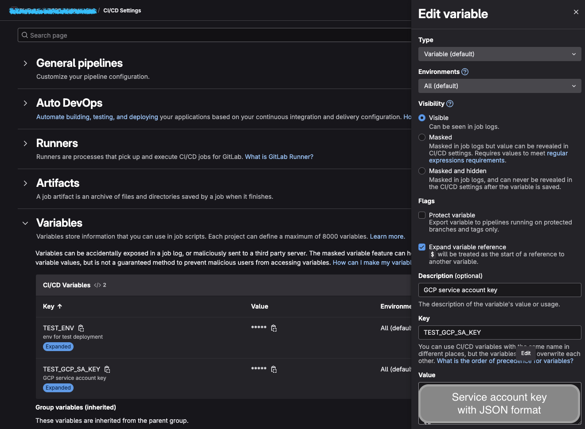
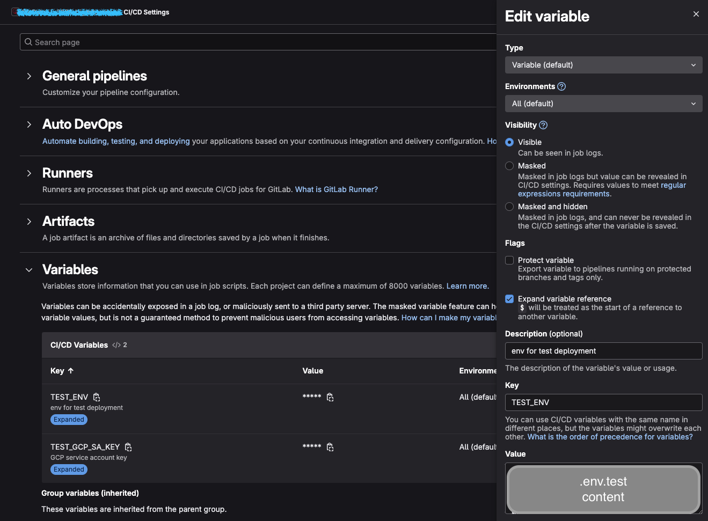

# Cloud Run deployment with GitLab CICD

## Create a Service account with proper roles for CI runner

1. In order to add and update the role of a service account, we need to ensure our account possess permission `resourcemanager.projects.setIamPolicy` before starting.
    - Check the permission in IAM and Admin > Roles
        
        [https://console.cloud.google.com/iam-admin/roles?inv=1&invt=AbqaKg&project=big-data-website-test](https://console.cloud.google.com/iam-admin/roles?inv=1&invt=AbqaKg&project=big-data-website-test)
        
2. Go to IAM and admin > Service accounts and click CREATE SERVICE ACCOUNT
<!-- truncate --> 
    
    
3. Apply service account name and assign it with following roles, click DONE
    1. Artifact Registry writer
    2. Cloud Run admin
    3. Service account user
        
        
        
        
        
4. Go and find that service account we just created, open the action menu and select ‘Manage keys’. 
    
    
    
    At the Key management tab, click ‘ADD KEY’ → ‘create a new key’ → choose JSON format → CREATE. Now the service account key will be downloaded to our local machine
    
    
    
    
    

## Config the CICD varaible

### Config the Service account key in CICD variables



### Config environment variables in CICD variables



## Create `.gitlab-ci.yml`

```yaml
image: google/cloud-sdk:latest

variables:
  TEST_PROJECT_ID: 'your-project-id'
  REGION: 'asia-east1'
  SERVICE_NAME: 'your-service-name'
  IMAGE_NAME: 'your-image-name'

stages:
  - build
  - deploy

.gcp_auth_test: &gcp_auth_test
  - echo "$TEST_GCP_SA_KEY" > /tmp/service-account.json
  - gcloud auth activate-service-account --key-file=/tmp/service-account.json
  - gcloud config set project $TEST_PROJECT_ID
  - gcloud auth configure-docker ${REGION}-docker.pkg.dev

test-build:
  stage: build
  services:
    - docker:dind
  variables:
    DOCKER_TLS_CERTDIR: '/certs'
    DOCKER_HOST: tcp://docker:2376
    DOCKER_TLS_VERIFY: 1
    DOCKER_CERT_PATH: '$DOCKER_TLS_CERTDIR/client'
  only:
    - develop
  before_script:
    - *gcp_auth_test
    - echo "$TEST_ENV" > .env.test
    - apt-get update -y
    - apt-get install -y docker.io
  script:
    - docker build --build-arg BUILD_ENV=test -t "${REGION}-docker.pkg.dev/${TEST_PROJECT_ID}/${SERVICE_NAME}/${IMAGE_NAME}:$CI_COMMIT_SHA" . --platform=linux/amd64
    - docker push "${REGION}-docker.pkg.dev/${TEST_PROJECT_ID}/${SERVICE_NAME}/${IMAGE_NAME}:$CI_COMMIT_SHA"

test-deploy:
  stage: deploy
  needs:
    - test-build
  only:
    - develop
  before_script:
    - *gcp_auth_test
  script:
    - |
      gcloud run deploy $SERVICE_NAME \
      --image "${REGION}-docker.pkg.dev/${TEST_PROJECT_ID}/${SERVICE_NAME}/${IMAGE_NAME}:$CI_COMMIT_SHA" \
      --region $REGION \
      --platform managed \
      --cpu 1 \
      --memory 512Mi \
      --min-instances 0 \
      --max-instances 1 \
      --allow-unauthenticated \
      --port 3000

```