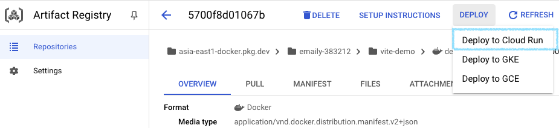

# Deployment with Cloud run
This article introduces how we can deploy a service (take NextJS as an example) to Google Cloud Run using Docker and GCP Artifact Registry.

## Create a project on GCP
First, we need to create a project on GCP.

## Create an Artifact registry

After creating the project, navigate to ‘Artifact registry’ and click ‘+ CREATE REPOSITORY’ to create a repository for out application.

Fill out proper info., like so:

1. set the **repository name**
2. set region to ‘asia-east1(Taiwan)’
<!-- truncate -->


## Setup gcloud CLI

1. Install gcloud CLI
2. Make sure your gcloud is **authenticated and active** with the same account as GCP account you want to deploy
    
```bash
gcloud auth login
gcloud auth list
```
    
3. setup Artifact registry permission
    
```bash
gcloud auth configure-docker ${Artifact registry}
```

*Artifact registry should be `${Region}-docker.pkg.dev`, e.g. `asia-east1-docker.pkg.dev`
    

## Build image for your app

1. write `Dockerfile` to build docker image
    - vite: use `serve` or `nginx` to handle static file serving
    - NextJS: as stated in the official docs 
        - example
        
        ```yaml
        example:
        FROM node:20-alpine AS base
        WORKDIR /app
        
        FROM base AS deps
        
        RUN apk add --no-cache libc6-compat 
        
        COPY package.json yarn.lock ./
        
        RUN yarn install
        
        FROM base AS builder
        WORKDIR /app
        
        ARG BUILD_ENV
        RUN if [ -z "${BUILD_ENV}" ]; then \
            echo "ERROR: BUILD_ENV is required" && exit 1; \
            fi
        
        COPY --from=deps /app/node_modules ./node_modules
        
        COPY . .
        
        RUN yarn build:${BUILD_ENV}
        
        FROM base AS runner
        ENV NODE_ENV=production
        
        RUN addgroup --system --gid 1001 nodejs
        RUN adduser --system --uid 1001 nextjs
        
        COPY --from=builder /app/public ./public
        
        RUN mkdir .next
        RUN chown nextjs:nodejs .next
        
        COPY --from=builder --chown=nextjs:nodejs /app/.next/standalone ./
        COPY --from=builder --chown=nextjs:nodejs /app/.next/static ./.next/static
        
        USER nextjs
        
        EXPOSE 3000
        
        CMD HOSTNAME="0.0.0.0" node server.js
        ```
            

2. build image

```
docker build -t ${REGION}.pkg.dev/${PROJECT_ID}/${REPOSITORY_NAME}/${IMAGE}:${TAG} . --no-cache=true --platform=linux/amd64
```

3. (optional) Test if the image run as you expected.
    
```
docker run docker run -it --rm -p 3000:3000 asia-east1-docker.pkg.dev/big-data-website-prd/big-data-app/big-data-app 
```
    

## Push docker image to Artifact Registry

```
docker push ${REGION}.pkg.dev/${PROJECT_ID}/${REPOSITORY_NAME}/${IMAGE}:${TAG}
```


*apple silicon will need to add this line at the end of the build command: `--no-cache=true --platform=linux/amd64`

## Deploy to Cloud Run

1. After pushing image, find your image that matches the name on the GCP artifact registry dashboard
2. Click the latest version of image and select ‘Deploy to Cloud Run’
    
    
    
3. Setup service configuration
    
    e.g. service name, region, authentication, container port, Maximum number of instances, as you like. Click CREATE
    
    
    
    
    
    