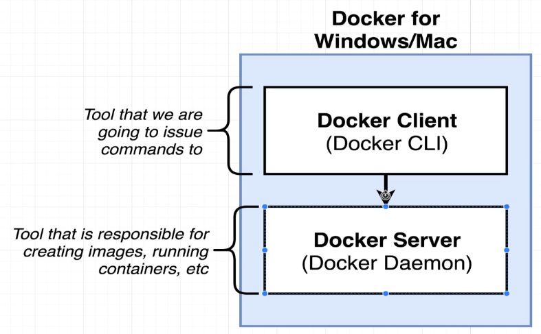
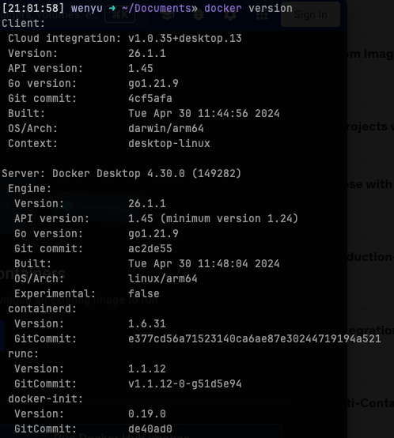
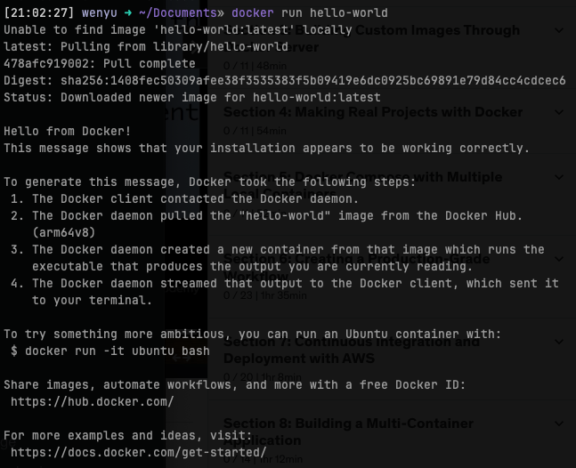
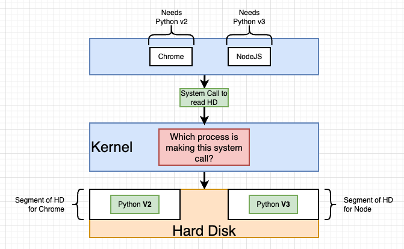
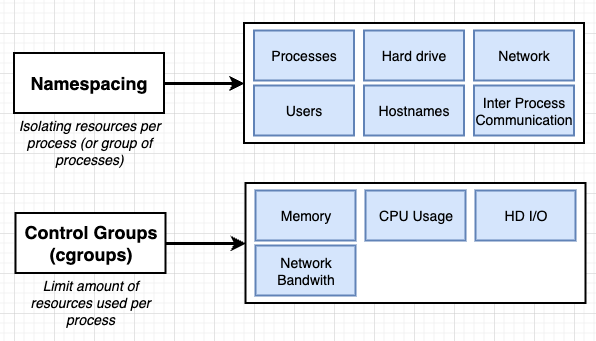
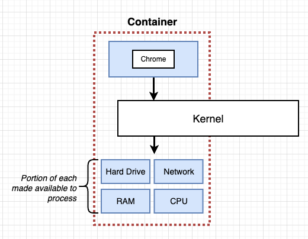
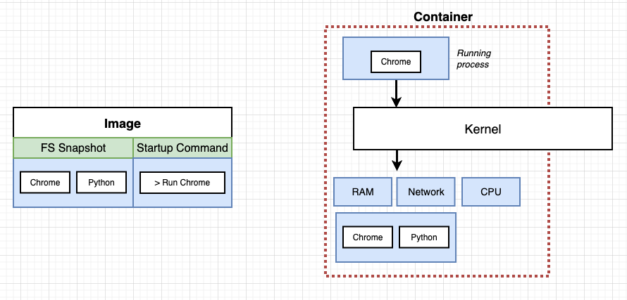
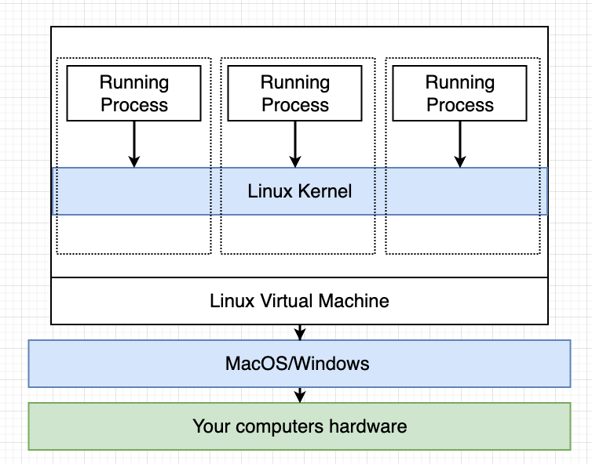
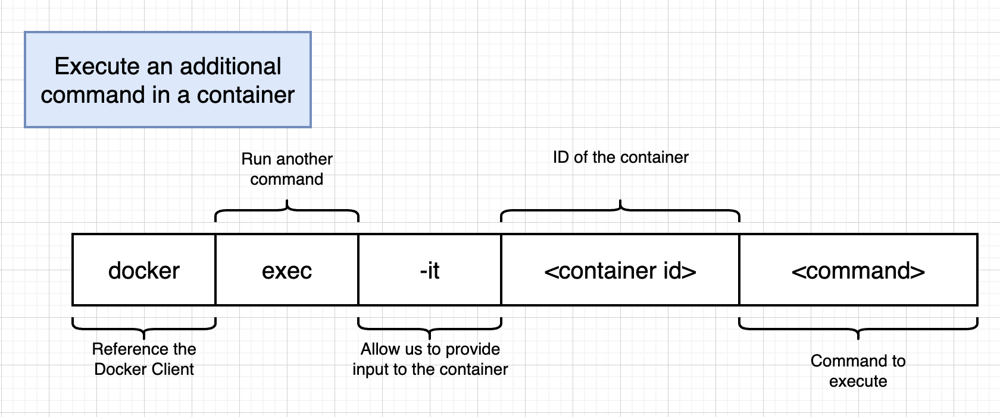

# Docker

### **Why docker?**

Docker makes it really easy to install and run software without worrying about setup or dependencies.





- Docker hub: A hub of free, public images that you can download and run on your computer.
- What does `docker run` do under the hood?
    1. type `docker run hello-world` -> I want to start a container used the image called `hello-world`
    2. docker client ask docker server to look up the image cache to see whether there's a image called `hello-world`
       
        ```
         >> Unable to find image 'hello-world:latest' locally
        ```
        
    3. if the image was not found, then the docker server will reach out to the free service called docker hub for the image
    4. the `hello-world` image is found at the docker hub, so the docker server download it and store it to the image cache, in case you'll need it in the future.
    5. Now that we have `hello-world` image in our computer, the docker server can use it to build a container (instance of the image) that runs a program. (The function of this program is just printing out some message on the terminal)
       
        
        

### **How OS works**

This question is qual to how process of programs (Node.js, Chrome...) communicate with the hard drives of your computer (disk, CPU, memory)

Typically, the communication is not directly happened between the process and the hard drives, but though a middle man called 'Kernel'. The whole procedure will be, if Node.js app wants to access the file system, it sends a 'system call' to the kernel, this is an endpoint provided by the kernel, and when the kernel received the system call, it then go and access the file system, for example, save a file, for you.


### Namespacing and Control Group (cGrops)

These two features is along with Linux, not default features of Windows and MacOS



**Namespacing**

限制並 redirect **process 或一組 processes** 能夠使用的資源來達到資源環境獨立這件事

isolating resources per process (or group of processes)

resources including not only hardware but also software

- hardware
- network
- ability of IPC (inter process communication)
- processes (see)

**Control Groups**

limit amount of resources used per process



### What’s docker container?

A process (or a group of processes) that have a group of resources that specifically assigned to it.



### What’s docker image?

A snapshot of file system (my program’s files) and the startup command



### What docker do under the hood?



- install docker will come along with the installation of linux VM, so that we can take advantage of the linux-specific features, namespacing and cGroup
- so our containers are running inside the linux VM

### Run command

docker run `<image-name>`

- try to create `<image-name>` and run a container with `<image-name>`, it has a default startup command Run `<image-name>`
- docker run = docker create + docker start
    - docker create `<image-name>`:
        - use image to prepare the container
        - return a container ID
    - docker start -a `<container-ID>`
        - execute the startup command
        - -a: print startup command result on the terminal

### Docker ps

- list running container informations
- —all: list container informations log

### Docker container life cycle

- we can inspect the status col of by running `docker ps --all`
- status
    - stopped
        - `docker stop <container-ID>`
        - `docker kill <container-ID>`
    - removed
        - `docker system prune` to remove all stopped containers, networks not used by at least one container, all dangling images, all build cache
        - we should execute this command once in a while , so that the stopped containers will not eat up out disk space.
    - running

### retrieving container’s logs

`docker logs <container-ID>`

### Executing command in **running** containers

`docker exec -it <container-ID> <your-command-here>`

ex: `docker exec -it fqfdgjlkl294 redis-cli`



- -it flag = -i + -t
- -i: make sure my terminal input is directed to the STDIN of running processes
- -t: the effect of this flag is to make the thing show up a bit more nicely formatted interaction interface

### Getting command prompt in a container

`docker exec -it <container-ID> sh`

this will run a (command processor) shell and execute the command inside the container

```scala
> docker exec -it e8a1707005c1 sh
# cd / 
# ls
bin   data  etc   lib	 mnt  proc  run   srv  tmp  var
boot  dev   home  media  opt  root  sbin  sys  usr
#
```

### Starting with a shell

`docker run -it <image-name> sh`

---

**Priority Order** (from highest to lowest):

- Docker run command line arguments
- command in docker-compose.yml
- CMD in Dockerfile

---

### Docker-compose

simplify the docker run related commands

### Docker volume

In the docker container's workdir, create a reference to the current working directory (pwd, which is the project folder)

Since data inside containers is generally a snapshot from when it was built, it won't update in real-time

Docker volumes are suitable for development when you need real-time updates.
