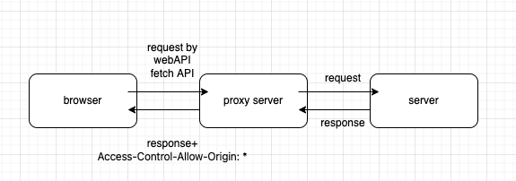

# 前端開發 CORS issue

## CORS issue 發生的原因

---

在開發階段， `webpack-dev-server`  會啓動一個本地 dev. server，運行在 localhost，而後端服務又是運行在另外一個 url，可能會有不同 `domain`, `port` 等等，因此會出現 `CORS issue` 導致 request 被瀏覽器擋住無法存取後端問題。

## 解決 CORS

---

開發上可以使用 `proxy server` 正向代理 server 來繞過這問題，因為 `CORS` 是來自瀏覽器的安全性限制，透過 `node` 發 request 也就不會受到 `CORS` 限制。 `proxy server` 方面，透過 `CORS header` 設定就可以順利把從後端拿到的資料傳回瀏覽器。

→ 有時候前端不能直接要求後端調整 header 時，例如你跟 API 來源方不是合作關係時，就常用這方式解決。否則，應該直接去請後端幫忙處理相關 `CORS` 設定。

如果是用 `express` 建立 `proxy server` ，可使用 `http-proxy-middleware` 來實作。如果是用 `webpack-dev-server` ，就直接到 `webpack.config.ts` 作設定，讓 dev server 開啟 proxy 功能。

（其實 webpack 背後也是在做類似的事情）

```tsx
devServer: {
   ...,
   proxy: {
      // 希望被辨識 api route
      '/api': {
         target: localhost:8080, // 要轉發的後端 url
         secure: false,
         changeOrigin: true
      },
      '/gw/api': {
         target: localhost:8080, // 要轉發的後端 url
               pathRewrite: {
                  '/gw/api': '/api' // 更細節自定義 route (ex: 開發階段不經過 gateway)
               },
         secure: false,
         changeOrigin: true
      }
	}
},
```

這樣設定之後 `http://localhost:5555/api` 的 request 就能被順利轉發到 `http://localhost:8080/api` 。

細節設定可透過`devServer.proxy` 屬性去調整。

**流程：**

1. 瀏覽器發 req. 到 proxy server
2. req. 被 proxy server 轉發到 server
3. server 回傳 res. 到 proxy server
4. 透過設定合適的 CORS header，proxy server 將 res. 回給瀏覽器



## Proxy server Cookie 設定失效問題

---

由於 cookie 只設定在指定 `path` 下 （預設為 req route），有機會在 proxy 後出現失效問題。

可藉由以下處理解決：

1. 後端 `set-cookie` 指定 `path`
2. 前端 proxy server 設定：
   - `webpack-dev-server` `onProxyRes` 改寫 `set-cookie` `path`
   - `webpack-dev-server` `cookieDomainRewrite` or `cookiePathRewrite`

## 後端設定（前端好像知道比較好的部分）

---

如果是要走`Access-Control-Allow-Origin` 設定的路線，前後端都需要分別設定一些其他東西才能運作。

1. 後端需要補上 `Access-Control-Allow-Origin`
2. 要判斷現在的 request 是否屬於簡單 request

   簡單請求要滿足以下條件：

   - method 是 `GET` 或 `POST`
   - 不可以有自訂 header
   - Content-Type 是 `application/x-www-form-urlencoded`、`multipart/form-data`、`text/plain`  這三種

   所以如果是使用 body `application/json` ，就會是非簡單請求，瀏覽器會在真正發 request 之前自動幫你發一個預檢請求 `preflight request` （OPTIONS）， 來幫你確保後端知道，且允許這個 request。

3. preflight request 會在 header 有這兩個 custom 欄位，他表示了現在要發的 request 的資料，用來詢問後端同不同意放行

   - `Access-Control-Request-Headers`: 如：content-type
   - `Access-Control-Request-Method`: 如：POST

   後端如果願意，就把 preflight route handler 補上 `Access-Control-Allow-Origin` ，`Access-Control-Allow-Headers` 填上要放行的 custom header

4. cookie 方面的處理，因為跨來源的請求，瀏覽器預設不會自動戴上 cookie

   後端的 response header 需要調整：

   - `Access-Control-Allow-Credentials: true`
   - `Access-Control-Allow-Origin`  不能是 `*`，需要明確指定 origin（例如要指定是前端的 [localhost:3000](http://localhost:3000) 之類的）。這是因為任何 origin 都可以發 request 到後端，且可以戴上 cookie ，這會有安全性問題 （類似於 CSRF 概念）

5. 前端使用 fetch API 的話要加上  `credentials: 'include'`，因為安全性考量，預設是 `same-origin`，表示要同 origin 才會帶 cookie 或其他 authentication data

6. 如果不希望重複發送 req. 時不要每次都重發 preflight 檢查，可以請後端設定 `Access-Control-Max-Age` 來在一段時間內快取住預檢。

## Browser direct actions

由 a tag href 連結或直接在瀏覽器貼上資源網址的方式都在此限。
CORS 限制的是 JS 指揮 fetch API 或 XHR 發的 request，browser direct actions 算是瀏覽器直接發起的 HTTP request，因此不受 CORS 限制。

=>https://chat.openai.com/share/26787a06-2d17-42b2-8b87-24c6b214cc2b

## Pitfall

`fetch API` 的 `mode: "cors"` 並不是讓你直接跨過 cors 拿到跨域資源的方法。他其實是會告訴瀏覽器，我們已經知道這 request 有 CORS issue ，不用給警告及 response。

所以結果是會得到 status code 0 的 空 response，但不會得到 cors 警告。

## Reference

---

[CORS 完全手冊（二）：如何解決 CORS 問題？](https://blog.huli.tw/2021/02/19/cors-guide-2/)

[跨域请求中携带 cookie 场景的解决方案实践 - 掘金](https://juejin.cn/post/7074217735928381448)

[CORS 完全手冊（三）：CORS 詳解](https://blog.huli.tw/2021/02/19/cors-guide-3/)

[How to use fetch() with CORS and credentials](https://byby.dev/js-fetch-cors-credentials)
