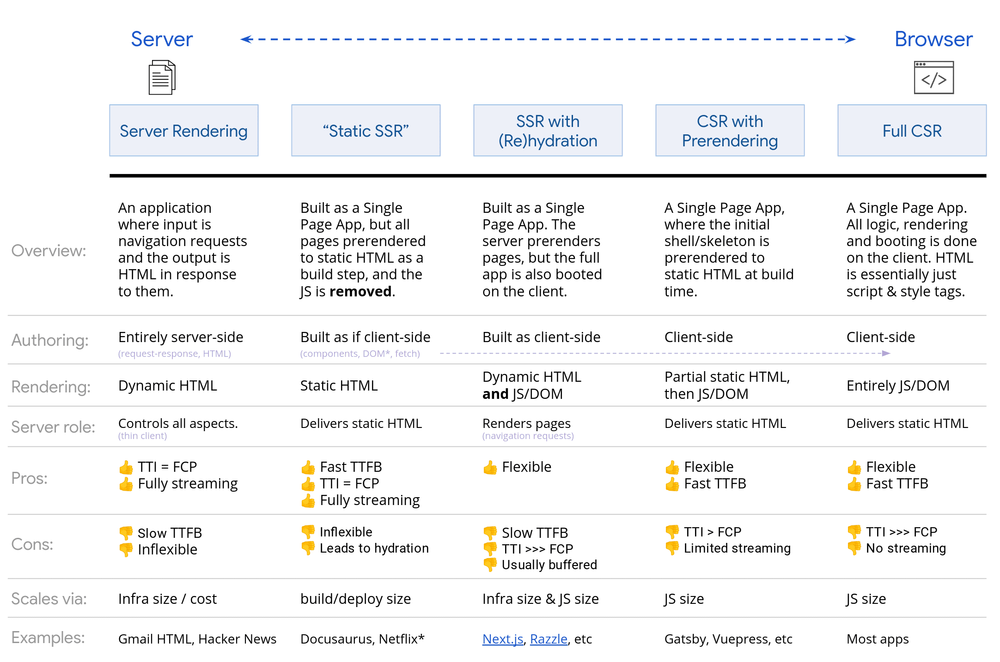

# NextJS Server component v.s. Client component

## Rendering pattern of Front-end web app

---

### Brief introduce of various kind of rendering patterns




## Server component and Client component: island-link rendering

---

### core concept

Server component 與他的執行

- Server component 是只會在 server 被執行的 React components
- 與先前的 server related rendering patterns 是截然不同的概念
  - 對於 CSR 以外 rendering patterns，如 SSR、SSG，實踐的方法仰賴框架提供的方法，如 NextJS 12 `getServerSideProps()`
  - RSC (React Server component) 則是獨立於套件提供的功能運作的
- Server component 在 server 執行時會產生兩個東西：

  1. 這個 server component 的 static HTML

  2. Virtual DOM 以 React data streaming format 形式產生，並帶在 script tag 傳到 client

     - React's new line-based internal data streaming format 
       - each line format `ID:TYPE?JSON`
       - 透過 `$ID or $LID (ex: $2 or $L2)` 來 refer 其他行


     - 主要功能
       -  Reconciliation：for DOM update 效能優化
       -  包含 client component 資源的 reference，指示 client component 應該被整合到哪個位置

- server component 基本上是靜態的，但如有需要，還是可以透過  `router.refresh()` 來重新跟 server 拿 server component。此過程不會造成 client component state 丟失。

  ````react
  import { useRouter } from 'next/navigation'
  const router = useRouter()
  router.refresh()
  
  //https://nextjs.org/docs/app/api-reference/functions/use-router
  //https://ithelp.ithome.com.tw/articles/10316916
  ````

  

Client component 與他的執行

- Client component 指的是那些需要在瀏覽器被執行（需要瀏覽器 API 才能執行）的 component，例如包含 interactivity, React hook 等等的
- Request time 還是會先在 server 被 pre-render 產生 static html 送到瀏覽器，這是預設行為 (SSR)
- Hydration：使 client component 具有互動性。以下是他如何整合進 DOM: 

  1. 在頁面被送回來之後，react runtime 會先作一次 Reconciliation

  2. 此時會發現 virtualDOM 包含了 client component 相關的 reference ，便會去找到那個 reference 並把 JS 下載下來
  3. React runtime render 此 client component ，並把他整合回去
- 需要注意的是，static html 不一定總是跟 hydration 之後的 html 一樣（例如執行 new Date，在 server 執行的時候得到的值一定會與在 client hydration 時得到的不同），因此會造成 Hydration failure
- 一旦發生 Hydration failure，react 會將整個 re-render document (from the Virtual DOM)
- 這個預設的 SSR 是可以控制關閉的


`use client` 做了什麼？

1. 告訴 bundler 將這些 JS 輸出成獨立 JS 檔，以便瀏覽器能夠 lazy loading 
2. 告訴上層 RSC 這是一個 client component ，在輸出 virtualDOM 時需要留一個包含其 JS reference 的 placeholder 
3. 告訴 compiler 在需要此 component 時要下載這個 component 的 JS
4. 注意：仍會在 server 被執行，光是給定 `'use client'` 不會關閉 SSR 功能
5. 就算沒用到 server 不能用的 client side 功能，也是 client component

-> 簡單理解，這個宣告是設定了一個 client component bundary（一條 RSC, RCC 的 network boundary），在這之內的 component 都會預設被以 client component 對待（所以官方說所有 component 預設都會是 server component 這一點是可能混淆的）


避免 Hydration failure，如何讓 client component 一律不在 server 執行？

- 使用 `next/dynamic` 並設定 `{ssr: false}`

  - 他是 `React.lazy()` 及 `<Suspense>` 的複合體

  ```react
  import dynamic from 'next/dynamic'
  const ClientComponent = dynamic(() => import('./ClientComponent'), {
    ssr: false
  })
  export const ClientComponentNoSSR = ()=><ClientComponent/>
  ```

  - 在回傳的 HTML 會有一段待插入動態生成 client component HTML 的地方

    ```HTML
    <!--$!--><template data-dgst="NEXT_DYNAMIC_NO_SSR_CODE"></template><!--/$-->
    ```


不同種交互 Server comp. and Client comp. 的情形是否可行？

被 render 順序，RSC > RCC

原則

1. RCC import 的東西都會被視為在 runtime render 的時候所需要的，但是 RSC 的 render 是在 RCC  之前的，所以如果 RSC 被 RCC import，會有兩種情況

   - RSC 不包含 server only 操作，如 access DB, file system...，此時 client component parent 會自動把他轉成 client component（說轉成 RCC 其實是被當作 client component 對待，因為他是 RCC render 需要，必須在 client side 執行，所以，這狀態下的這個  不包含 server only 操作又沒有 use client  宣告的 component 其實在哪邊執行都可以，要說他是 RSC, RCC 都可以，應也可以較他 mix component）
   - RSC 包含 server only 操作，在 client 端執行出錯，必須改為 RSC 作為 RCC children 的模式傳入。這種情況 RCC 本身只知道會有 children，但不會執行 children，只是把他拿到的 children 放進來，所以 children 在哪個環境被 render 的都可以。

2. 承上，RCC 不能也無法干涉 RSC render，所以要依據條件 render children 的 RSC 是做不到的

3. 不同於 'use client', 'use server' 的宣告不能限制 component 只在 server 執行，原因同 1.

   

| A > B               | RSC > RCC                                                    | RCC > RSC                                                    |
| ------------------- | ------------------------------------------------------------ | ------------------------------------------------------------ |
| Import A in B       | 不 ok, 代表 RCC 需要 RSC 才能 render，而 RSC 的生成一定在 RCC 前，無法回過頭去產生 RSC。另外 RSC 如果有用到 server-only 的功能，也不可能在 client render<br />有一例外是，如果在 RSC 當中沒有用到 server-only 的功能，他就會被 client component 當作 client component 使用，並且不會報錯<br />白話：我需要 RSC 來產生 RCC (我需要 RSC 這個元件來組成 RCC 這箱子) | ok, RSC 會在 virtualDOM 產生 placeholder，當需要時把 react runtime render 完的 RCC HTML 放入 |
| A is Children  of B | ok, children 就是一個參數，prop 算是一個 container ，不會在意內容是什麼。但有個條件，RSC 會通過網路傳輸，因此要是 serialisable (可序列化)<br />我要把 RSC 放到 RCC 裡面（我要把 RSC 放到 RCC這個箱子裡，所以 RSC 是在哪裡被產的跟箱子無關） | ok                                                           |
| A as Props of B     | the same as pass as children case                            |                                                              |
|                     |                                                              |                                                              |

### concept differences from Next 12

Next12 SSR 與 Next13 RSC 最大不同在於

- SSR 重點是頁面初始渲染的那個 HTML 是在 server 產，之後前端路由切換只會去下載所需要的資料 （`getServerSideProps`) ，並不會重新產 HTML。因此可以比 SPA 更快看到第一個畫面，而又可以保有 SPA 動態渲染頁面內容的好處

### Pros & cons of server component

- Props
  1. Reduce bundle size
  2. Take advantage of server power
  3. automate code splitting

- Cons 
  1. Increasing in complexity

## Pitfalls 

---

1. not every component is default server component, but depends on the boundary


2. declare "use client" not making only that specific component client comp., but setting a "Client boundary"


3. server comp. can direct import and use client comp., while if client comp. directly import srever comp. could cause error


## MUI 問題踩到奇怪的坑
---
1. client component 不是可以 import 到 server component 嗎？為何外面一定要包一層？因為前幾版的 MUI component 沒有 'use client'  宣告，所以我們需自己加， nextjs 才知道他是 client component
2. https://mui.com/blog/mui-next-js-app-router/
   -> 說是 mui/core 的元件在 v5.14.0 開始已經支援


## references
---
- [Dan 神解釋 Client component, Server component Modal](https://github.com/reactwg/server-components/discussions/4)
- [Server component, client component 的圖解判斷](https://twitter.com/tweetsbycolin/status/1656010147951697920/photo/1)
- https://juejin.cn/post/6918602124804915208
