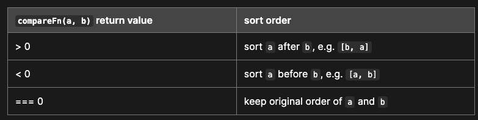

# JS 常用語法

## for loop

---

### for-in

- 列舉出 key， 對 object 來說就是 key， 對 array 來說就是 index
- `for in`會遍歷自定義屬性，甚至原型鏈上的屬性也會遍歷到

```js
const expArray = ['apple', 'avocado', 'banana']
for (let item in expArray) {
  console.log(item)
}
// 0 1 2

const expObject = { name: 'apple', type: 'fruit', weight: 915 }
for (let item in expObject) {
  console.log(item)
}
// name type weight
```

### for-of

- 列舉出可迭代（iterable) 元素的值。如：Array, String

```js
const expArray = ['apple', 'avocado', 'banana']
for (let item of expArray) {
  console.log(item)
}
// apple, avocado, banana

const expString = 'abcdef'
for (let letter of expString) {
  console.log(letter)
}
// a b c d e f
```

## Array method

---

### forEach

- 對每一個 Array 元素作某種唯讀操作時使用
- 單純作遍歷，不可以配合 `continue`、`break`、`return` 等語句
- 不會改變原本的 Array

```js
const expArray = ['apple', 'avocado', 'banana']
expArray.forEach((item) => {
  console.log(item)
})

// apple, avocado, banana
```

### map

- 對每個 Array 元素作某種 mutation 操作時使用
- 不會改變原本的 Array
- 回傳元素 mutate 之後的 Array

```js
const expArray = ['apple', 'avocado', 'banana']
expArray.map((item) => {
  return `${item}-goodgoodeate`
})

// ['apple-goodgoodeate', 'avocado-goodgoodeate', 'banana-goodgoodeate']
```

### filter

- 對每個 Array 元素依據某種條件篩選時使用
- 不會改變原本 Array
- 回傳元素篩選之後的 Array

```js
const expArray = ['apple', 'avocado', 'banana']
expArray.filter((item) => {
  return item[0] === 'a'
})

// ['apple', 'avocado']
```

### reduce

- 依據傳入 callback 來將 Array 中元素由左至右化為一個值

  `myArray.reduce((accumulator, currentValue) => accumulator + currentValue, initialValue);`

  - `accumulator` 累加器是上一次呼叫後，所回傳的累加數值。從第一個元素開始被傳入處理
  - `currentValue` 是目前處理到的數值。從第二個元素開始被傳入處理
  - `initialValue` 是 optional，累加的初始值


### sort

- 對每個 Array 元素依據某條件來排序

  - 不傳入排序條件判斷用 function，就是使用預設排序，數字由升冪排、字母 a-z

  - 傳入排序條件判斷用 function，使用 function 判斷，依據回傳數字來定義元素的「相對順序」



- 不會改變原本 Array

- 回傳元素篩選之後的 Array

```js
const expArray = [123, 1233, 253]

expArray.sort((a, b) => {
  return a - b
})

// [123, 253, 1233]
```

:::caution Pitfall

> If `compareFn` is not supplied, all non-`undefined` array elements are sorted by converting them to strings and comparing strings in UTF-16 code units order. For example, "banana" comes before "cherry". In a numeric sort, 9 comes before 80, but because numbers are converted to strings, "80" comes before "9" in the Unicode order. All `undefined` elements are sorted to the end of the array.

擷取自 MDN。如果 `compareFn` 沒有提供，就會把所有元素都轉成 string，然後用 UTF-16 code units order 去排序。所有 `undefined` 的元素會被排到最後。

要注意的是元素如果有數字，他可能會出現排序不如預期的情況，例如 "80" 排在 "9" 的前面

:::

### splice

- 刪除 Array 中一元素並插入一元素

  ` myArray.splice(要刪除及插入元素的 index, 要刪除元素個數, 要插入的元素)`

  - 要刪除元素個數: optional，沒有傳的話就是把 要刪除元素的 index （含）之後的元素都刪除

- 會改變原本的 Array

- 回傳被刪除元素的 Array

```js
var myFish = ['angel', 'clown', 'drum', 'sturgeon']
// 從 index 2 開始刪除 1 個元素，並插入 'trumpet'
var removed = myFish.splice(2, 1, 'trumpet')

// myFish 為 ["angel", "clown", "trumpet", "sturgeon"]
// removed 為 ["drum"]
```

### slice

- 依據傳入 Array index 得到 Array subset

  `Array.slice(開始的 index, 結束的 index)`

  - 開始 index：

    - 必傳
    - 傳負數就是從後面數來要拿幾個的意思

  - 結束 index：
    - optional，不傳的話就是 `Array length + 1`
    - 要傳的是 `希望得到的最後元素 index + 1 `，例如要拿 index 0, 1, 2 這三個位置的元素，結束 index 不是傳 2，而是要傳 3

- 會回傳 slice 後的 Array subset

- 不會修改到原本的 Array

```js
var fruits = ['Banana', 'Orange', 'Lemon', 'Apple', 'Mango']
fruits.slice(1, 3) // ['Orange', 'Lemon']
fruits.slice(1) // ["Orange", "Lemon", "Apple", "Mango"]
fruits.slice(-2) // ['Apple', 'Mango']
```

### push

- 將元素放到 Array 的最後面
- 會改變原來的 Array
- 改變原本 Array 之後會呼叫 `length()`，回傳新 Array 長度

```js
const expArray = ['apple', 'avocado', 'banana']
expArray.push('candy')
// 4
console.log(expArray)
// ['apple', 'avocado', 'banana', 'candy']
```

### pop

- 移除 Array 最後的一個元素
- 會改變原來的 Array
- 回傳移除的最後一個元素

```js
const expArray = ['apple', 'avocado', 'banana']
expArray.pop()
// 'banana'
console.log(expArray)
// ['apple', 'avocado']
```

### shift

- 移除 Array 中的第一個元素
- 會改變原來的 Array
- 回傳移除的第一個元素

```js
const expArray = ['apple', 'avocado', 'banana']
expArray.shift()
// 'apple'
console.log(expArray)
// ['avocado', 'banana']
```

### unshift

- 從最前面加入一個或多個元素到 Array
- 會改變原來的 Array
- 改變原本 Array 之後會呼叫 `length()`，回傳新 Array 長度

```js
const array1 = [1, 2, 3]

console.log(array1.unshift(4, 5))
// Expected output: 5

console.log(array1)
// Expected output: Array [4, 5, 1, 2, 3]
```

### every

- 依據傳入的判斷 function Array 元素是否「都」符合某條件
- 回傳 `true` 或 `false` 分別代表所有元素都符合條件或有不符合的元素

```js
const array1 = [1, 2, 3]
array1.every((digit) => digit > 1)
// false
array1.every((digit) => digit > 0)
// true
```

### some

- 依據傳入的判斷 function Array 元素是否「部分」符合某條件
- 回傳 `true` 或 `false` 分別代表有元素符合條件或都不符合條件

```js
const array1 = [1, 2, 3]
array1.some((digit) => digit > 5)
// false
array1.some((digit) => digit > 2)
// true
```

### includes

- 判斷 Array 是否包含某元素
- 回傳 `true` 或 `false`

```js
const array1 = [1, 2, 3]
array1.includes('banana')
// false
```

### find

- 依據傳入的判斷 function 回傳第一個符合條件的元素

```js
const array1 = [1, 2, 3]
array1.find((digit) => digit >= 2)
// 2
```

### findIndex

- 依照傳入的判斷 function 找 Array 中符合的第一個元素
- 如果找到，回傳元素在 Array 中的 `index`
- 如果沒找到，回傳 -1

```js
const array1 = [1, 2, 3]
array1.findIndex((digit) => digit >= 2) // 1
array1.findIndex((digit) => digit > 200) // -1
```

### indexOf

- 判斷 Array 中有沒有某元素
- 如果找到，回傳元素在 Array 中的 `index`
- 如果沒找到，回傳 -1

```js　
const array1 = [1, 2, 3]
array1.indexOf(1) // 0
array1.indexOf(123) // -3
```

### concat

- 用來合併兩個 Array
- 不會改變原本的 Array
- 回傳合併之後的 Array

```js
const array1 = [1, 2, 3]
const array2 = [4, 5, 6]
array1.concat(array2)
```


### flat

`Array.flat(dept)`

- 用來將巢狀 array 攤平成一維
  - dept 可傳巢狀層數，預設為 1，無法預知的話可傳 `Infinity`
- 不會改變原本的 Array
- 回傳合併之後的 Array

```js
const array1 = [1, 2, [3, 4, 5]]
array1.flat()
// [1, 2, 3, 4, 5]
```


## Object method

---

### keys

- 得到 object key Array

```js
const obj1 = {
  name: 'bbokari',
  age: 5,
}
console.log(Object.keys(obj1))
// ['name', 'age']
```

### values

- 得到 object value array

```js
const obj1 = {
  name: 'bbokari',
  age: 5,
}
console.log(Object.keys(obj1))
// ['bbokari', 5]
```

### entries

- 將 object key & value 轉換成 array，包進一個 array 回傳

```js
const obj1 = {
  name: 'bbokari',
  age: 5,
}
console.log(Object.entries(obj1))
// [["name", "bbokari" ], ["age", 5]]
```

### assign

- 將兩個 object 結合為一個

```js
let arr = [{ a: 10 }, { b: 20 }, { c: 30 }]

let obj = arr.reduce((acc, current) => {
  return Object.assign(acc, current)
}, {})
console.log(obj)
// { a: 10, b: 20, c: 30 }
```

### conditional object property

```js
const isBarExist = false
const isMooExist = true

const item = {
  foo: 'foo',
  ...(isBarExist && { bar: 'bar' }),
  ...(isMooExist && { moo: 'moo' }),
}

console.log(item)
// {foo: 'foo', moo: 'moo'}
```


## ES6

---

### 物件屬性省略寫法

當使用變數來建立 object 時，希望物件的屬性名稱就是變數名稱，可以省略不寫屬性名稱

```js
const name = 'fileName'

const fileMap = {
  name
  // 等同於 name: name
}

console.log(fileMap)
// { name: 'fileName'}
```


## String

---

### toLowerCase

- 會將字串中的所有字母都轉換為小寫，不考慮語言的區域設定。
- 例如：`"Hello World".toLowerCase()` 會返回 `"hello world"`。

### toLocaleLowerCase

- 類似於 `toLowerCase`，但會考慮到當前環境的語言設定，根據語言區域轉換字母為小寫。
- 這意味著一些語言可能有不同的小寫轉換規則。例如，土耳其語（Turkish）中的 "I" 在小寫時會變成 "ı"，而不是 "i"。
- 這個方法可以接受一個參數，用來指定要使用的語言環境，但通常情況下不需要傳入參數，它會自動使用當前環境的設定。
- 例如：`"Hello World".toLocaleLowerCase()` 會根據語言設定返回相對應的小寫字串。
