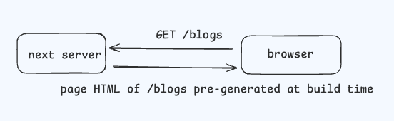

# NextJS Rendering Patterns

## Page router

### Client-side Rendering (CSR)

### Static Site Generation (SSG)

### Server-side Rendering (SSR)

### Incremental Static Regeneration (ISR)

## App router

### Server components
- static rendering
    - routes are rendered at build time, or in the background after data revalidation. 
- dynamic rendering
    - routes are rendered for each user at request time.
    - During rendering, if a dynamic function (cookies(), headers(), searchParams()) 
      or uncached data request is discovered, Next.js will switch to dynamically rendering the whole route. 
- streaming rendering
The rendering work is split into chunks: by individual route segments and Suspense Boundaries 

