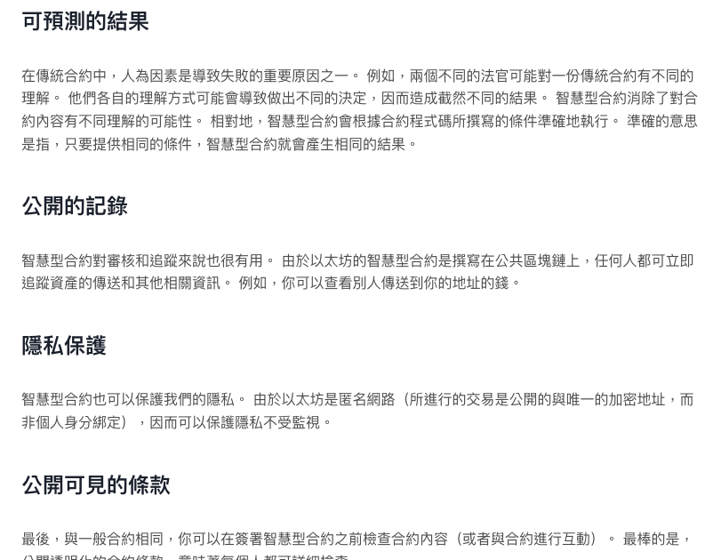
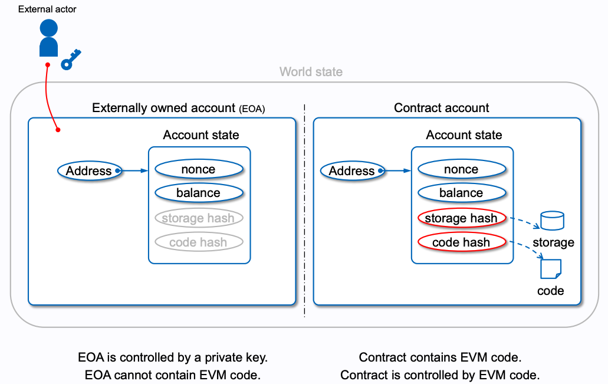

# Ethereum

## 什麼是以太坊 Ethereum？

---

以太坊是一個開源的區塊鏈平台（網路）。 以太坊是分布在全世界的不同電腦組成的網路，這些網路都遵守 Ethereum protocol 以太坊網路是建立與使用的社群、應用程式、組織、數位資產的基礎（任何人都可以建立與使用）

**https://ethereum.org/** 是以太坊（Ethereum）的官方網站，網站的建立並不是由單一間公司所擁有或建立，而是由以太坊社區共同建立和維護。

以太坊的創立者是 Vitalik Buterin，他於 2013 年提出了以太坊的概念。然而，以太坊的發展和維護是由全球的開發者社群共同參與和貢獻的，並且有以太坊基金會（Ethereum Foundation）作為支持組織。是一個獨立非營利組織，旨在**推動以太坊區塊鏈技術的發展和應用**。

## 加密貨幣

---

與貨幣相同，加密貨幣也是一種用來提升以物易物效率的東西，是一種用來描述以區塊鏈技術作為加密手段的同質化代幣（fungible digital tokens）

例如比特幣，他免除了需要對第三方的信任，而可以在兩個對象之間轉移的特性。在比特幣世界裡，大家只需要相信比特幣程式碼 （程式碼都是公開在網路上免費可以取得查看的），而非是基於你對第三方組織或者機構的信任（例如政府）。

叫做加密貨幣的原因是因為，他是基於密碼學來保障安全性的。

:::caution 注意事項

加密貨幣不完全等於虛擬貨幣，準確來說加密貨幣算是虛擬貨幣的子集合，而虛擬貨幣是個通稱，他泛指儲存在數位媒介當中的貨幣。 如：加密貨幣、楓之谷楓幣

:::

## 以太幣 (ether, ETH)

---

以太坊有自己的原生加密貨幣，稱為以太幣 (ether, ETH)，他的用處是支付在以太坊網路上的任何活動，例如支付在以太坊上面建構與運行應用程式所需要的計算費用。ETH 也可以在不同用戶之間轉移，換取 ETH 或者其他加密貨幣。

## 智能合約

---

以太坊在每個運作的節點上都運行著一個以太坊虛擬機 (Ethereum Virtual Machine, EVM)，用來執行智能合約 (Smart Contract)。

智能合約是一個儲存在區塊鏈上的一個程式，因為他是程式，具有極高邏輯性，且寫成了就不能改變了這就解決了傳統合約的一些問題，例如履行性的問題，在口頭或是紙筆契約已經在法律上成立，但很多時候對方如果不履行，是有機會你也不能拿他怎樣的。

智慧型合約將協議轉化成數位形式，也就是將協議條款轉變成電腦程式碼，並在符合合約條款時自動執行，就確保了合約的可預測性，雙方不能早、也不能晚履行合約，同時也就沒有了信任問題。

以下是更多智能合約的好處 （擷取自 [以太坊官網](https://ethereum.org/)）

## DApp (Decentralize App)

---

[DApp](./DApp.md)

## EVM (Ethereum Virtual Machine)

---

以太坊虛擬環境是由以太坊 client 幫忙在節點上運行的虛擬環境。他會負責運行部屬到以太坊網路的智能合約 (Byte code)。

## Ethereum State and Block

---

World State: account 與 account state 的 Mapping 集合。

Ethereum 的 State 經由一個集合的 Transaction (Block) 從原本的樣子轉換成新的樣子，以此角度來看 Ethereum 就是 State chian

在實作角度，可稱為 BlockChain

## Node

---

運行 Ethereum client 的設備（如：電腦），這些 node 靠著 client 與彼此聯絡形成 Peer-to-Peer network。

可以理解 node 是 Ethereum 的實作，負責根據協議規則驗證數據並保持網絡安全。 

Node 可分為三種：

1. Full node
   - 儲存所有 Ethereum 的當前狀態
   - 參與區塊的驗證、驗證全部的區塊及狀態
2. Light node
   - 只下載 Ethereum block header（區塊的摘要資訊）
   - 需要其他部份的資料，會發 request 去跟 full node 拿
   - 不參與共識機制，不可以作為 miner/validator
3. Archieve node
   - 存儲了整個區塊鏈的歷史資料，包括所有交易、智能合約的源城市、過去的狀態和交易記錄等。

## Account 帳號

---

Account 在 Ethereum 代表可以發送 transaction 的一個實體。

**Ethereum 有兩種帳號：**

1. Externally-owned account (EOA)：一般帳號，由具有 private keys 的人掌控。

   1. 不需創建費用 (gas fee)

   2. 可以起始一個 transaction

   3. EOA 之間只能交易 ETH/token

   4. 由一組 public key/private key 構成，共同管理帳戶的活動

2. Contract account: 部署到以太坊區塊鏈上的智能合約

   1. 部屬需要付費

   2. 只能以因為外部 transaction 被觸發，這樣的形式發起 transaction

   3. 被觸發而執行的功能不只是交易 ETH/token，甚至可能創建帳號

   4. 不具有 private keys，是以智能合約中的邏輯管理的

   5. 42 character hexadecimal

**Ethereum 的帳號會具有四種欄位：**

1. nonce: 一個代表交易的計數值

2. balance: 這個地址的 wei 數（1e+18 wei per ETH.）

   > 以太坊區塊鏈上的最小單位，用於表示以太幣（ETH）和其他加密代幣的數量。以太坊的所有金額、交易費用（gas 費用）和餘額都是以 wei 為基礎來表示，這種微小的單位使我們能夠在區塊鏈上精確地處理各種金額

3. codeHash

4. storageRoot

## Gas

---

在 Ethereum 當中的 transaction 需要消耗計算資源，例如我要把 eth 從 A 帳號轉到 B 帳號，或是要 deploy 智能合約，就需要付出一點 Gas。而運算資源的基本單位即是 Gas

付出 Gas 是一種資安手段，使得智能合約的函式不會因為駭客攻擊而陷入無窮迴圈。

Gas fee 的計算方式是 Gas 單位 (unit) 乘上每一單位的金額。

`units of gas used * (base fee + priority fee)`

每一單位金額的計算可以分為兩個部分，第一是 base fee，這是 protocol 預設的基本金額，要超過這金額 transaction 才被視為合法。第二是 priority fee，你願意付出愈多，就越能夠吸引礦工接下這份 transaction 的計算，但這也會受到當前 traffic (network usage) 的影響，如果 traffic 高，那可能就會需要付出更多一點的 priority fee。

例子， A 要轉 1 ETH 給 B，ETH 轉帳需要 21,000 units 的 gas，base fee 是 10 gwei，A 願意付出的 priority fee 是 2 gwi

`21000 x (10 + 2) = 252,000 gwi = 0.000252 ETH`

所以加上 gas fee，A 總共會被扣款 1.000252 ETH。

> 因為通常 gas fee 相較於 ETH 是很少的，使用 wei 這個 ETH 最小的單位表示，用避免浮點數不精確問題
>
> 1 ETH = 1018 wei
>
> 1 gwi = 109 wei

## Base fee

---

- 每個區塊都有自己的 Base fee，任何 transaction gas fee 至少要等於 base fee 才會被視為合法。

- Block 一旦被建立，base fee 就會被 `burn` ，被銷毀不再流通了，而非支付給礦工。
- 每個區塊的 Base fee 是由前一個區塊的 Block size 與目前 Base fee 來決定的。

## Priority fee (tips)

---

吸引礦工來處理、驗證你的 transaction 用的費用。

## Block size

---

所有 transaction 使用的 gas 總量。

- 每個 Block 都具有容量目標大小
- transaction 產生的 Gas 不超過 15 millon
- 這是 15 millon 目標大小是為了限制交易與操作的數量，基於確保網路效能、防止濫用即可預測性等考量所定義
- 實際上 Block size 是有可能超過 15 millon

## Max fee

---

你願意在 transaction 付出最多多少 gas fee。

- 要超過 Base fee + priority fee
- 如果太低的話，對礦工來說就比較沒有吸引力，可能比較久才被處理到
- 多的部分 (`max fee` - `sum(base fee, priority fee)`) 會被退還

## Gas limit

---

你願意在 transaction 付出最多多少 units 的 Gas 。

- 多給的話會退還 (refund) 多的部分
- 少給的話不會退還，因為計算還是會開始，只要有消耗資源，就要付出代價
- 一個標準 ETH 的轉移需要 2,100 units gas，像是涉及智能合約互動這種需要多一點計算資源的，就會更多
- 會影響到 transaction 是否能被執行完成

## EIP-1559 與 EIP-1559 之前的 Gas fee 計算比較

---

EIP-1559 Gas fee 為 `Gas price x Gas limit`，也就是只能藉由調整 Gas price 降低或提升每單位 Gas 願意支付的價錢，來吸引礦工幫忙處理交易。當大量交易發生時，Gas price 可能在礦工的選擇（不確定性因素）之下而攀升。使用者不得不設定較高 Gas price 來確保交易被優先處理。 另一方面，也有可能因為 Gas price 設定過低，而導致交易很久之後才被處理到。

為了改善 Gas fee 計算，引入了 EIP-1559 計算模型。

EIP-1559 的 Gas fee 是由 `units of gas used * (base fee + priority fee)` 計算而得。

並且引入了`maxFeePerGas` 和 `maxPriorityFeePerGas` 這兩個參數。

> - `maxPriorityFeePerGas` - 在交易中多願意為一單位 Gas 付多少 priority fee
> - `maxFeePerGas` - 在交易中最多願意為一單位 Gas 付多少總 Gas fee (inclusive of `baseFeePerGas` and `maxPriorityFeePerGas`)

此模型使得 Gas fee 變得更複雜，但帶來可預測性較高的 Gas fee 及較有效率的交易市場。

## Transaction 交易

---

Transaction 是由 account 發起的一種改變以太坊 state 的行為。像是 transfer ETH 就是最簡單的 transaction。

以 account 為單位，每筆交易都會有自己的 nonce 值，這是不重複的值，代表著這筆交易順序。

**Transaction life cycle:**

1. Transaction (Tx) 發起

2. Tx 被廣播傳到 Ethereum network 每個 node，node 收到後將 Tx 先放到 mempool (transaction pool, 待處理 Tx 存放的地方，通常會依據 gas fee 順序排列)

3. 礦工將這些 Tx 打包到新的區塊中。然後要求 network 中的其他 node 來驗證與確認這區塊。

4. 順利的話，區塊的狀態會由 "justified" 變為 "finalized"，一旦變成 "finalized" Tx 就代表完成了。

   

## Ethereum Improvement Proposals (EIPs) 

---

[EIP](https://eips.ethereum.org) 是描述以太坊平台上面的個中規格標準用的，包括核心協議、client APIs、合約標準。

如：EIP-1193: Ethereum Provider JavaScript API ，它定義了一個稱為「Provider」的 JavaScript API，使 DApp 能夠與以太坊區塊鏈互動。

## JSON-RPC (JSON-Remote Procedure Call )

---

定義以傳輸 JSON 格式資料來跟 Ethereum 互動（包括讀取 Ethereum 的資料或是發送 Treansaction）的無狀態、輕量 protocol，
例如 metamask 在 window.ethereum 注入的 provider API ，就是一種符合 JSON-RPC 的 JSON-RPC API。

## Network 

---

1. Publick network

   ethereum 公開網路，只有有連網路都能連接得上。任何人都可以讀取或是建立 transaction，並且驗證 transaction。

   - Mainnet

     ethereum 主網，是正式 (production) 環境，在上面流通的都是真正可以換成法幣的 ETH。

   - Testnet

     用於開發 DApp、智能合約的測試用網路，通常會在部署到 Mainnet 之前在這裡測試，在上面使用的是不具有真實價值的測試用 ETH。
     
     提供測試用 ETH 的 Faucet：
     
     如 Sepolia: https://sepoliafaucet.com/ ，給定 address 一天可以取得 `0.1 ETH` 

   - Layer2 Testnet

2. Private network

   - Development networks

   - Consortium networks

## 非同質化代幣 (Non-fungible token)

---

- 一樣的物品如何區分出不同的價值，如：兩張百元鈔票，一張有明星簽名，一張沒有，有明星簽名的實際上會值錢一點
- 區塊鏈技術可以用來做到非同質化這件事
