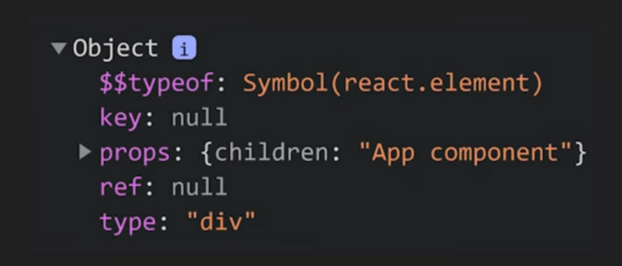

# React Virtual DOM and Reconciliation

React takes advantage of Virtual DOM and Reconciliation to optimize the update of DOM. This article will introduce the principles and implementation of Virtual DOM and Reconciliation.

Before understanding Virtual DOM and Reconciliation, we need to understand the concepts of React element and React component first.

## React element

When we write a React component, React converts JSX into `React.createElement(...)` function calls behind the scenes. This function returns a plain object. This is why we always need to import React when creating components.

For example, let's look at an App component:

```jsx
const App = (props) => {
  const { name } = props
  return <div id={name}>hi</div>
}
```

It actually gets transformed into:

```js
const App = (props) => {
  const { name } = props
  return React.createElement(
    'div',
    {
      id: name,
    },
    'hi'
  )
}
```

If we call `console.log(App())`, we'll get an object like this, which is a React element:



> React.createElement
>
> 1. First parameter is the element type
> 2. Second parameter is the props for function components
> 3. Third parameter is the children

## React component

A React component is either a class (class component) or function (function component) that returns an element tree.

Following the example above, App is a React (function) component.

When we write `<App/>`, React will:

- For function components: Call the function component with props
- For class components: Create an instance and call the render function

## Virtual DOM

As shown above, React converts nested JSX into a tree of React elements in object form, which is also known as the virtual DOM.

## Reconciliation

Initially, this virtual DOM is synchronized directly with the real DOM. But what happens when any React elements change?

React doesn't directly modify the real DOM because DOM operations are expensive. Instead, it compares the differences between the old and new virtual DOM to determine if changes are necessary before committing to the real DOM. This comparison and synchronization process is called Reconciliation.

React uses a diffing algorithm to optimize this synchronization process. To find the minimum number of operations needed for synchronization, the diffing algorithm makes two assumptions:

1. Elements of different types will produce completely different virtual DOMs

   > - If the types are different (e.g., changing from `<h1>` to `<h2>` or from `<Component1/>` to `<Component2/>`): React will recreate the virtual DOM
   >
   > - If the types are the same: For example, if only the props are updated, React will only update those props without recreating the DOM

2. Developers should provide a **key** for elements in dynamically changing lists, and this key should be unique

   For example, in the following code, we must provide a key for each `li`. Usually, if you're certain the data won't change, using `index` is fine:

   ```jsx
   const renderListData = () => {
     const data = ['one', 'two']
     return (
       <ul>
         {data.map((item, index) => {
           return <li key={index}>{item}</li>
         })}
       </ul>
     )
   }
   ```

   However, more often, the data might change dynamically. For example, if we need to add 'zero' before 'one', the key changes would be:

   ```
   item 'one' / key 0
   item 'two' / key 1

   == insert 'zero' =>

    item 'zero' / key 0
    item 'one' / key 1
    item 'two' / key 2
   ```

   We can see that the keys of the original elements have changed, but they're still on the screen and their order hasn't changed, so they shouldn't need to be re-rendered. In this case, we shouldn't use index as the key. Instead, we should define a fixed unique value for each element. This way, React will know during reconciliation that 'one' and 'two' haven't changed and don't need to be re-rendered, only 'zero' needs to be inserted.

   ```jsx
   const renderListData = () => {
     const data = ['one', 'two']
     return (
       <ul>
         {data.map((item) => {
           // Assuming items won't be duplicated, use item as key
           return <li key={item}>{item}</li>
         })}
       </ul>
     )
   }
   ```

## Reference

[How Does React Actually Work? React.js Deep Dive #1](https://www.youtube.com/watch?v=7YhdqIR2Yzo&t=752s)

[Preserving and Resetting State](https://react.dev/learn/preserving-and-resetting-state#state-is-tied-to-a-position-in-the-tree)
