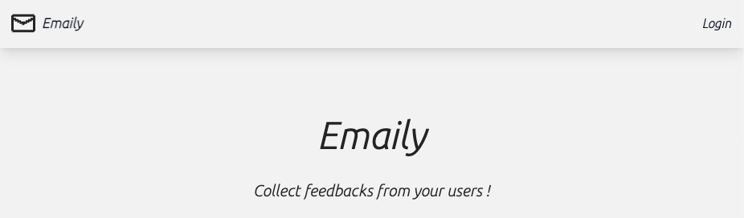

## 簡介

---

Emaily 是一個蒐集用戶使用體驗的網站，提供 Google 快速註冊登入、付費加值以發送調查信件給你的用戶，並可在後台呈現調查數據。



### 使用技術

---

前端： React (TypeScript), Redux, Redux-thunk, Redux-form, Tailwind CSS

後端： Express, Mongoose, passport-google-oauth20, SendGrid, Stripe

```
此專案功能發想及後端來自 Udemy 課程 Node with React 專案，唯有前端實作部分為自行建立，並非原創。
```

### 主要功能

---

#### 1. Google 註冊與登入


#### 2. 付費加值


此處輸入測試的卡號 `4242 4242 4242 4242` 來作測試。


付款成功，多了 5 credits!


#### 3. 使用 1 credit 來發送一個調查信


填寫信件內容


確認結果後發送


#### 4. 用戶收到了你發出的調查信


這份調查同時顯示在儀表板上，隨時可以檢視調查狀態


### DEMO 連結與原始碼

---

[Emaily](https://measly-letters-production.up.railway.app/surveys)

[GitHub](https://github.com/WenYHsieh/Emaily)
