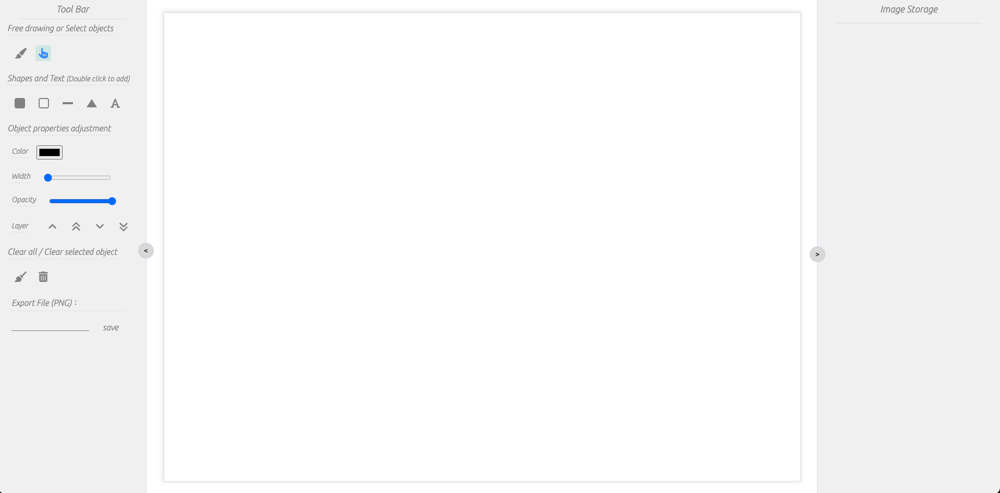
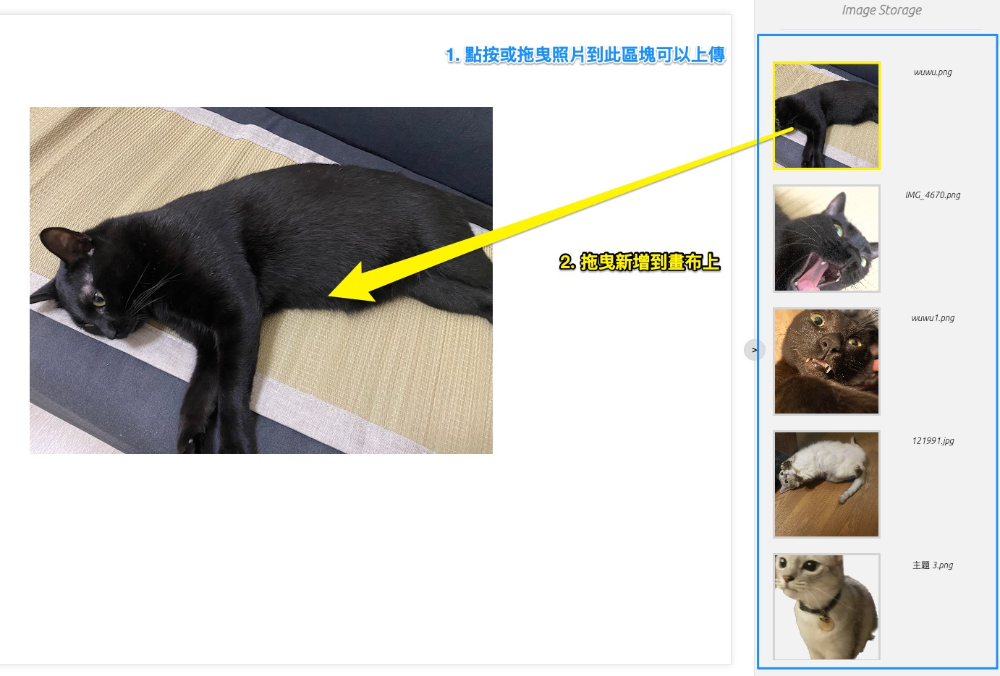
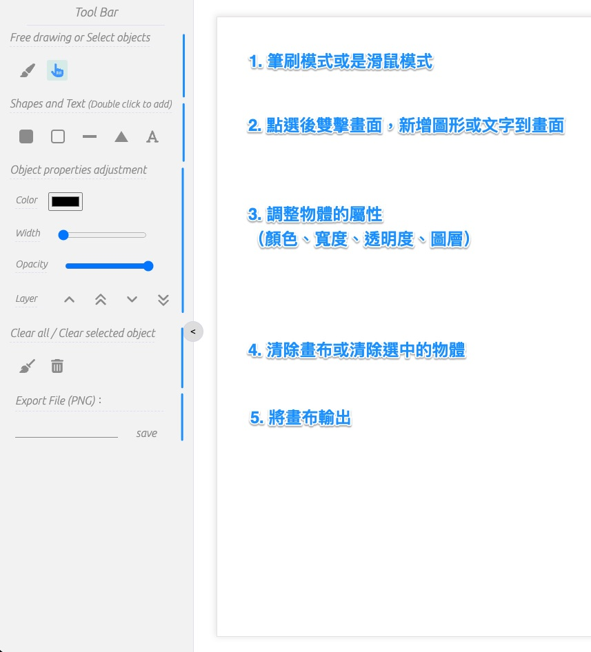
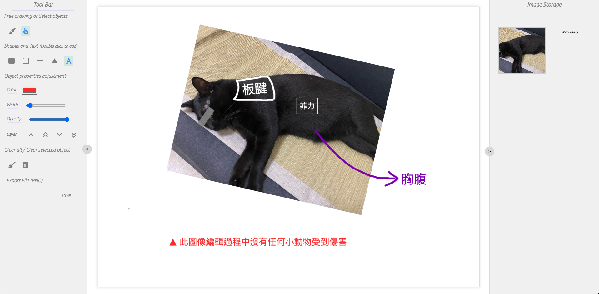
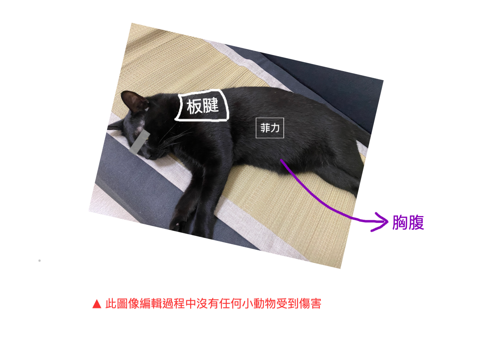

## 簡介

---

這是一個用 ReactJS 與 fabricJs 建構的簡易版照片編輯工具。

可以進行常見的一些的照片編輯，手寫或是新增圖示標記，亦可以作為普通畫布使用。

### 使用技術

---

前端： React (TypeScript), fabricJS

### 主要功能

---

#### 1. 照片存放區：一次上傳一或多張照片，並拖曳到畫布中編輯

#### 2. 右方工具列

#### 3. 使用工具進行編輯

#### 4. 輸出畫布

### DEMO 連結與原始碼

---

[Image Editor](https://wenyhsieh.github.io/Image-Editor/)

[GitHub](https://github.com/WenYHsieh/Image-Editor)
